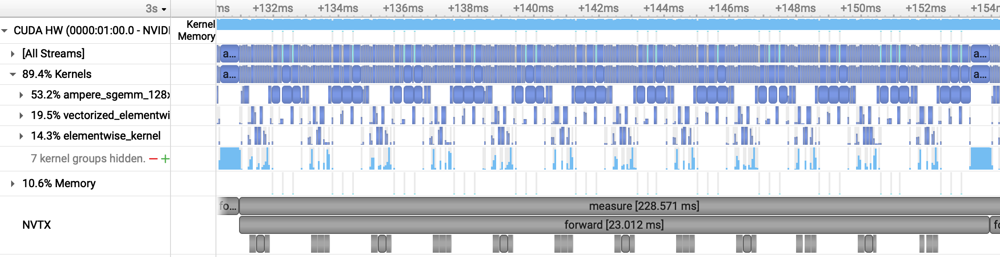
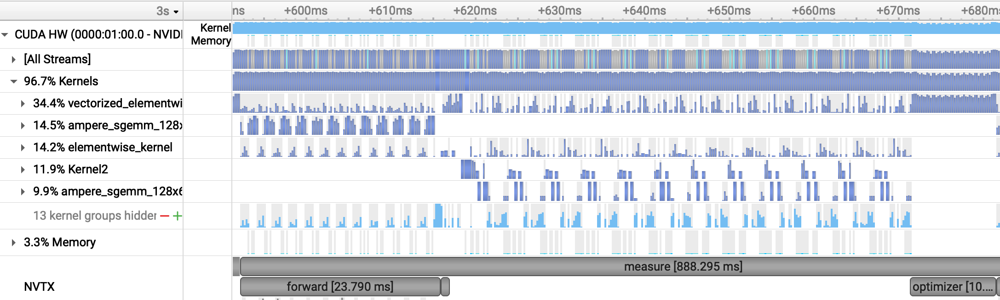
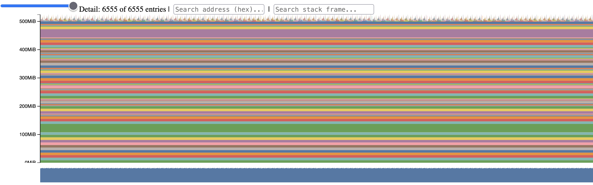
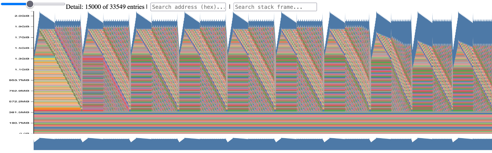

# CS336 Assignment 2: Systems

In this repo, I've written some model and kernel performance benchmarks and practiced memory profiling. I wrote all the code by hand as is required in the original assignment, and the text in this README is also written by hand. As a practice exercise, I also derived FlashAttention from scratch with some light guidance from ChatGPT. (I'm familiar with matmul tiling from my work at Windsurf, so it wasn't much of an extension from there, though computing the tiled backward pass was a bit involved.)

I ran these benchmarks on RTX 4090s that I rented online via Vast.ai. The assignment handout is [cs336_assignment2_systems.pdf](./cs336_assignment2_systems.pdf).

## Model benchmarks

Ran `./cs336_systems/benchmark_model.py`. Again, I'm on small GPUs so couldn't run the larger models.

"backward" refers to forward AND backward pass. "optimizer" means fwd, bwd, AND optimizer step.

| fp32   | forward | backward | optimizer |
| ------ | ------- | -------- | --------- |
| small  | 0.024   | 0.081    | 0.091     |
| medium | 0.074   | 0.231    | 0.261     |
| large  | 0.171   | -        | -         |

| bf16   | forward | backward | optimizer |
| ------ | ------- | -------- | --------- |
| small  | 0.013   | 0.046    | 0.054     |
| medium | 0.038   | 0.123    | 0.155     |
| large  | 0.080   | 0.262    | -         |

TODO: benchmark compiled models

Observations:
1. Backward pass is about 2-3x slower, which makes sense in terms of relative #ops
2. bf16 is about 2x speedup. We'd expect 2x faster memory reads and much steeper improvements for compute -- therefore these models are memory-bound, which makes sense.

## Profiling

### CUDA profiling

inference:

training:

nsys profile:
1. CUDA processing time split for forward pass:
	1. 53% GEMM
	2. 34% elementwise ops
	3. 11% memory ops (this was all initialization)
2. backward has a larger % time spent on elementwise ops. this is because some elementwise ops (eg activations, batch norm) require 2-5x more ops than forward pass, and those ops also tend to be memory bound. also, gradient accumulation (reduce) takes time.
3. nsys timings were slightly faster than python timeit, which makes sense since timeit has a bit of CPU overhead.
4. softmax is slower than attention matmuls, even though softmax is way fewer FLOPs. this is because softmax is memory bound (requires elementwise exp + AllReduce + division), while matmuls are compute bound and the compute is super optimized.

mixed precision: we want to matmul in low precision (fp16) while accumulating in high precision (fp32). this is because the final accumulated value is N times larger than the individual values, so we will lose precision that the individual values have unless we accumulate in fp32, and the efficiency loss is not crazy.

### Memory profiling

inference:

training:

memory profile:
1. during inference, memory gets released almost immediately once it's not needed anymore (peak ~500MB). during training, the activations are accumulated for backprop (and then removed once used). but when optimizer state is being updated, the gradients are NOT freed until zero_grad. (peak ~2GB) (context length 128)
	1. context length 1024 increases activation memory footprint by a lot, but backward & optimizer is the same
	2. MP reduces by ~25%
2. interesting: the A1 AdamW implementation loops over parameters one by one, which is why there is a 12-cycle pattern in the peak memory usage. this is obviously suboptimal, and the PyTorch native implementation combines tensors together & fuses the ops for efficiency.
4. checkpointing: reduces peak memory by >60% for context length 1024. doesn't help at all for 128. this is because peak activations per layer scales by T^2.

## Kernel benchmarking

Ran `./cs336_systems/benchmark_attention.py`. Note this is naive attention, not FlashAttention or anything optimized.

| Context | d_model | Forward (100) | Graph memory | Backward (100) | Status |
|---:|---:|---:|---:|---:|:---|
| 256 | 16 | 0.0116 s | 0.012 GiB | 0.1489 s | OK |
| 1,024 | 16 | 0.0207 s | 0.080 GiB | 0.1423 s | OK |
| 4,096 | 16 | 0.2805 s | 1.024 GiB | 1.1567 s | OK |
| 8,192 | 16 | 1.3553 s | 4.032 GiB | 4.4120 s | OK |
| 16,384 | 16 | 4.0112 s | 16.049 GiB | — | OOM during backward |
| 256 | 32 | 0.0161 s | 0.021 GiB | 0.1110 s | OK |
| 1,024 | 32 | 0.0326 s | 0.082 GiB | 0.1465 s | OK |
| 4,096 | 32 | 0.3660 s | 1.032 GiB | 1.2122 s | OK |
| 8,192 | 32 | 1.4758 s | 4.048 GiB | 4.7153 s | OK |
| 16,384 | 32 | — | — | — | OOM |
| 256 | 64 | 0.0154 s | 0.022 GiB | 0.1098 s | OK |
| 1,024 | 64 | 0.0357 s | 0.086 GiB | 0.1447 s | OK |
| 4,096 | 64 | 0.3679 s | 1.048 GiB | 1.1553 s | OK |
| 8,192 | 64 | 1.5948 s | 4.079 GiB | 4.6306 s | OK |
| 16,384 | 64 | — | — | — | OOM |
| 256 | 128 | 0.0139 s | 0.024 GiB | 0.1711 s | OK |
| 1,024 | 128 | 0.0332 s | 0.094 GiB | 0.1437 s | OK |
| 4,096 | 128 | 0.3920 s | 1.079 GiB | 1.1763 s | OK |
| 8,192 | 128 | 1.6077 s | 4.142 GiB | 4.9230 s | OK |
| 16,384 | 128 | — | — | — | OOM |

Observations:
1. For smaller T,d, dominated by startup cost & memory bandwidth
2. When compute-bound, timing varies as O(T^2d) as expected
3. Memory also varies as O(T^2 + Td)

## FlashAttention

FlashAttention is pretty cool. the idea is essentially just tiling the matmuls w/online softmax. there are some interesting optimizations though, like in the backward pass it turns out you can get away with elementwise ops by reusing saved $O$ to compute $dS$.
